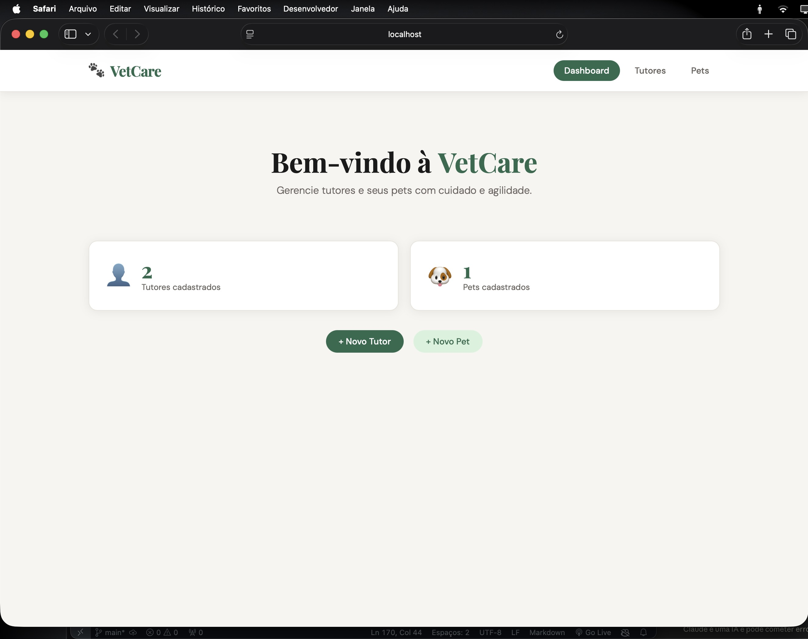
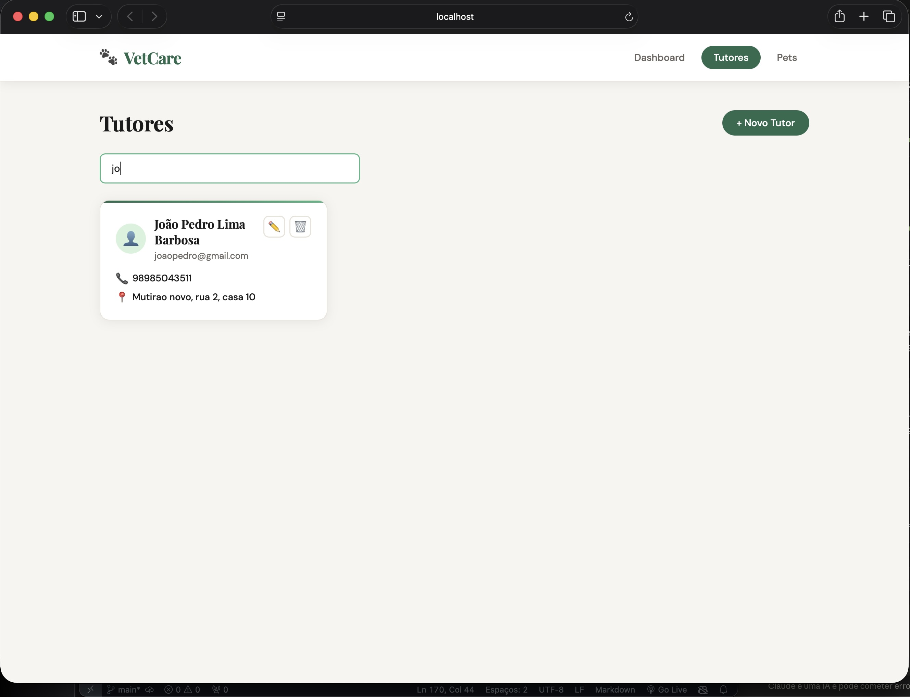
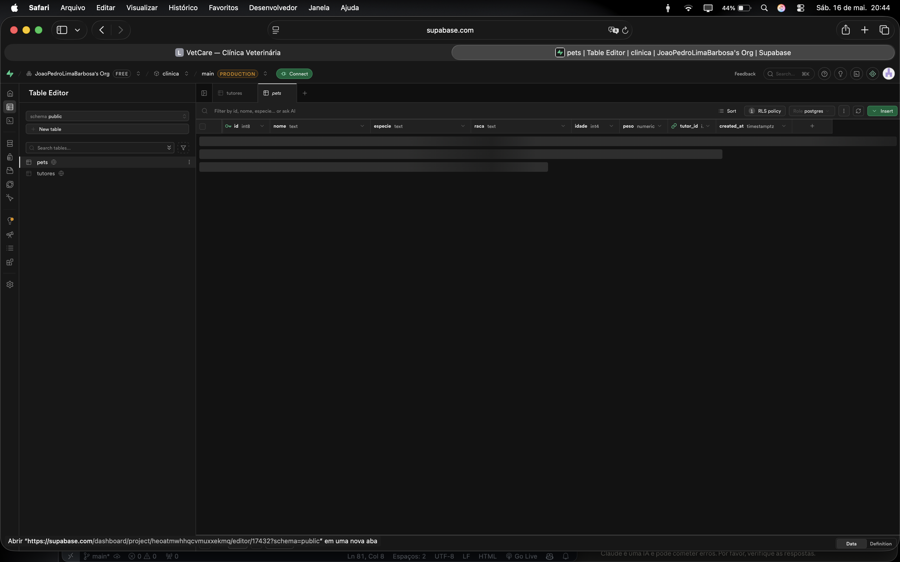
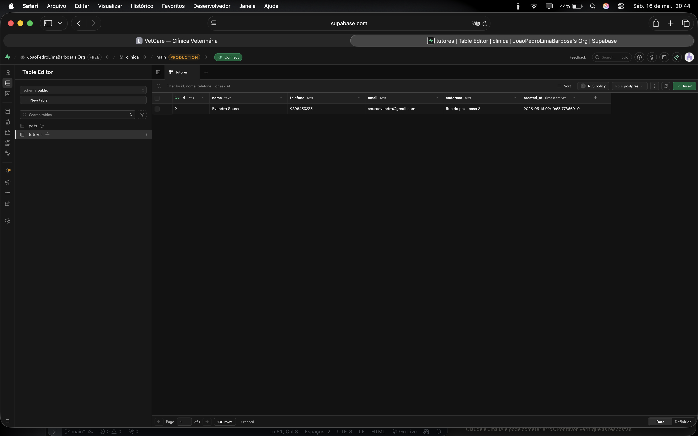
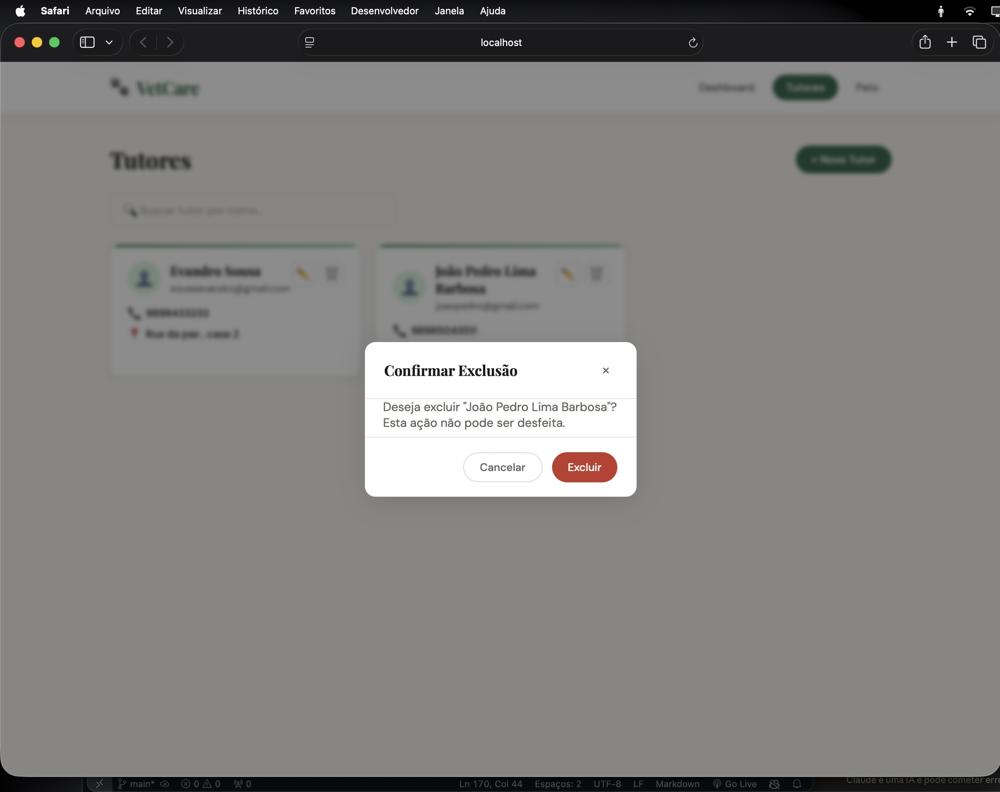
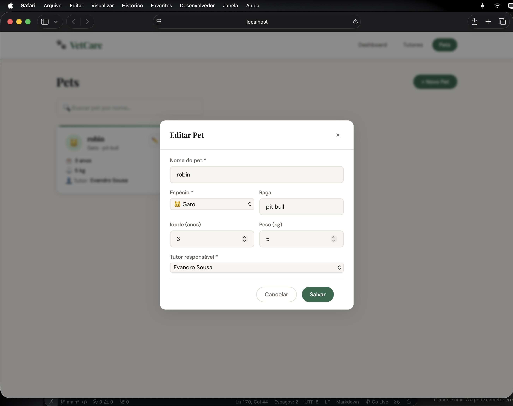
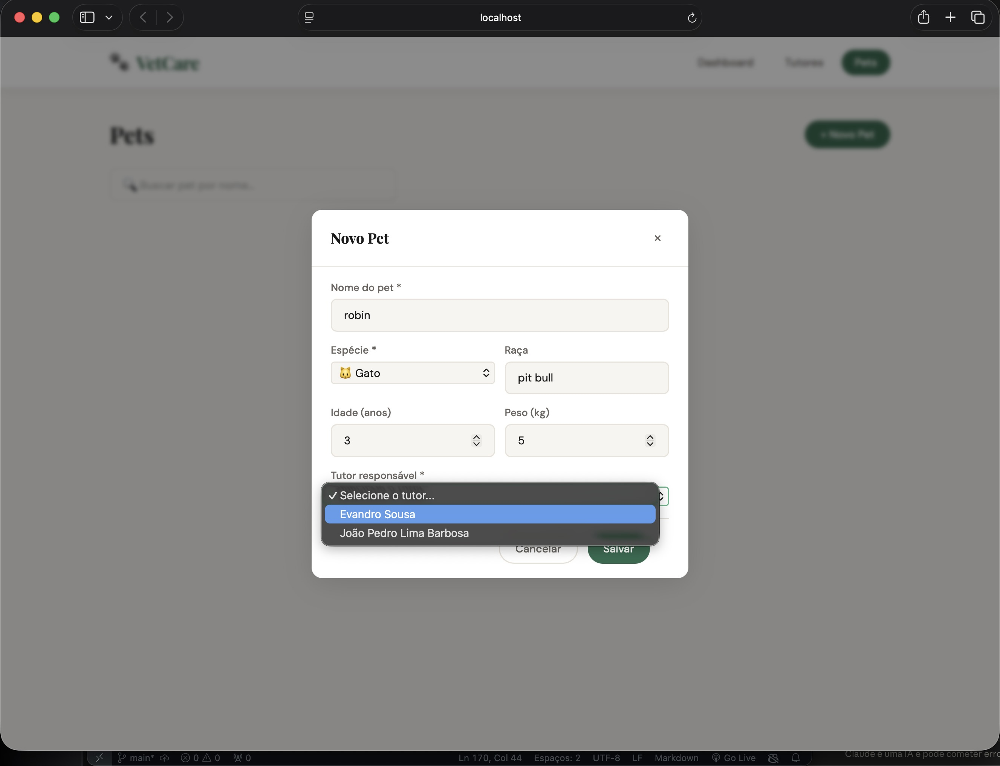
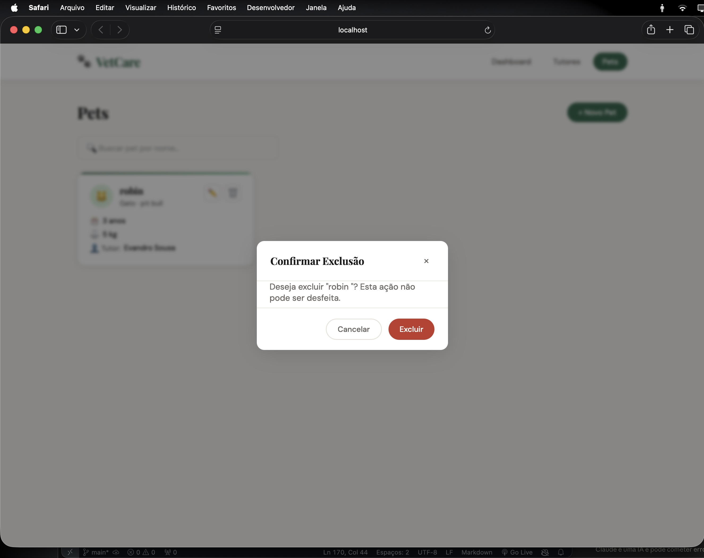
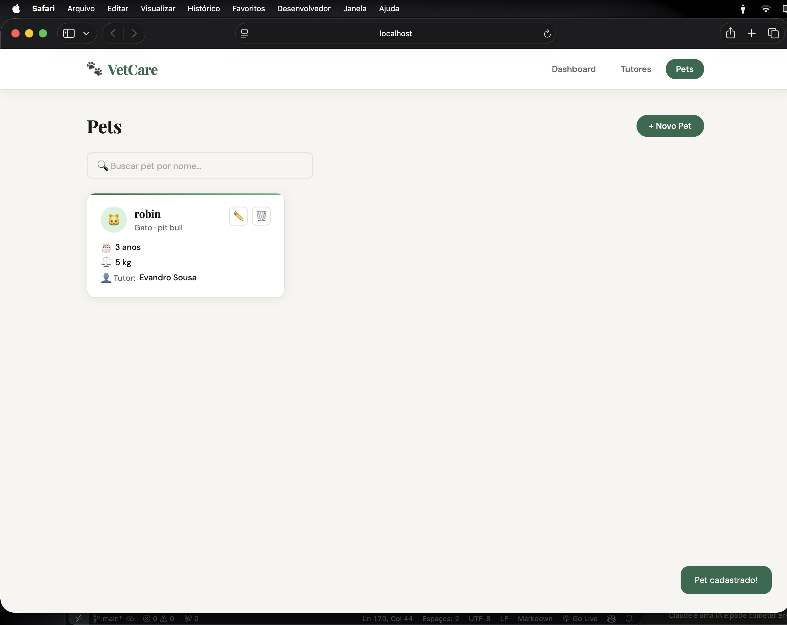
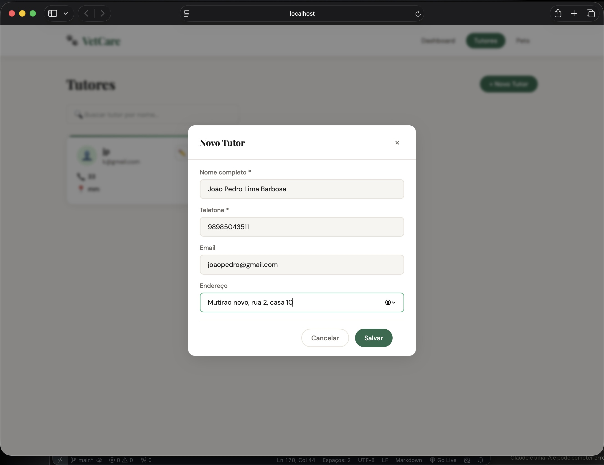

# 🐾 VetCare — Sistema de Clínica Veterinária

Sistema web completo para gerenciamento de uma clínica veterinária, desenvolvido com Node.js, Express, Supabase, HTML, CSS e JavaScript.

---

## 📋 Descrição do Sistema

O **VetCare** permite cadastrar e gerenciar **tutores** (donos de animais) e seus **pets**, oferecendo:

- ✅ Dashboard com estatísticas gerais
- ✅ CRUD completo de Tutores
- ✅ CRUD completo de Pets
- ✅ Busca/filtro por nome em tempo real
- ✅ Interface moderna e responsiva
- ✅ Feedback visual com notificações (toast)
- ✅ Confirmação antes de excluir

---

## 🛠️ Tecnologias Utilizadas

| Camada     | Tecnologia              |
|------------|-------------------------|
| Back-end   | Node.js + Express       |
| Banco      | Supabase (PostgreSQL)   |
| Front-end  | HTML5 + CSS3 + JavaScript |
| API        | REST com fetch + async/await |

---

## 🗄️ Estrutura do Banco de Dados

### Tabela `tutores`
| Coluna    | Tipo    | Descrição         |
|-----------|---------|-------------------|
| id        | int8    | Chave primária    |
| nome      | text    | Nome do tutor     |
| telefone  | text    | Telefone          |
| email     | text    | Email             |
| endereco  | text    | Endereço          |

### Tabela `pets`
| Coluna    | Tipo    | Descrição              |
|-----------|---------|------------------------|
| id        | int8    | Chave primária         |
| nome      | text    | Nome do pet            |
| especie   | text    | Espécie                |
| raca      | text    | Raça                   |
| idade     | int4    | Idade em anos          |
| peso      | float4  | Peso em kg             |
| tutor_id  | int8    | FK para tabela tutores |

---

## 🚀 Como Executar o Projeto

### Pré-requisitos
- [Node.js](https://nodejs.org/) instalado
- Conta no [Supabase](https://supabase.com/) (gratuita)

---

### 1️⃣ Configurar o Supabase

1. Acesse [supabase.com](https://supabase.com) e crie uma conta
2. Crie um novo projeto
3. Vá em **SQL Editor** e execute o seguinte SQL:

```sql
-- Criar tabela de tutores
CREATE TABLE tutores (
  id bigint generated by default as identity primary key,
  nome text not null,
  telefone text,
  email text,
  endereco text,
  created_at timestamp with time zone default now()
);

-- Criar tabela de pets
CREATE TABLE pets (
  id bigint generated by default as identity primary key,
  nome text not null,
  especie text not null,
  raca text,
  idade integer,
  peso numeric(5,2),
  tutor_id bigint references tutores(id) on delete cascade,
  created_at timestamp with time zone default now()
);

-- Habilitar acesso público (para desenvolvimento)
ALTER TABLE tutores ENABLE ROW LEVEL SECURITY;
ALTER TABLE pets ENABLE ROW LEVEL SECURITY;

CREATE POLICY "allow all" ON tutores FOR ALL USING (true) WITH CHECK (true);
CREATE POLICY "allow all" ON pets FOR ALL USING (true) WITH CHECK (true);
```

4. Vá em **Settings → API** e copie:
   - **Project URL** (ex: `https://xyzxyz.supabase.co`)
   - **anon public key**

---

### 2️⃣ Configurar o Projeto

1. Clone ou baixe o projeto
2. Abra o arquivo `index.js` e substitua as credenciais:

```js
const SUPABASE_URL = 'https://SEU_PROJETO.supabase.co'; // ← coloque aqui
const SUPABASE_KEY = 'SUA_CHAVE_ANON_AQUI';             // ← coloque aqui
```

---

### 3️⃣ Instalar Dependências

```bash
npm install
```

---

### 4️⃣ Rodar o Servidor

```bash
node index.js
```

Ou com hot reload (recomendado durante desenvolvimento):

```bash
npm run dev
```

---

### 5️⃣ Acessar o Sistema

Abra o navegador em:

```
http://localhost:3000
```

---

## 📁 Estrutura do Projeto

```
clinica-veterinaria/
│
├── index.js          # Servidor Express + rotas da API
├── package.json      # Dependências do projeto
│
└── front/
    ├── index.html    # Interface principal
    ├── style.css     # Estilos
    └── script.js     # Lógica do front-end (fetch, CRUD)
```

---

## 📡 Rotas da API

### Tutores
| Método | Rota               | Descrição          |
|--------|--------------------|--------------------|
| GET    | /api/tutores       | Listar tutores     |
| GET    | /api/tutores/:id   | Buscar por ID      |
| POST   | /api/tutores       | Cadastrar tutor    |
| PUT    | /api/tutores/:id   | Editar tutor       |
| DELETE | /api/tutores/:id   | Excluir tutor      |

### Pets
| Método | Rota           | Descrição       |
|--------|----------------|-----------------|
| GET    | /api/pets      | Listar pets     |
| GET    | /api/pets/:id  | Buscar por ID   |
| POST   | /api/pets      | Cadastrar pet   |
| PUT    | /api/pets/:id  | Editar pet      |
| DELETE | /api/pets/:id  | Excluir pet     |

---

## 📸 Prints do Sistema

### Dashboard




### Supabase



### Tutores



### Pets





### terminal 




---

## 👨‍💻 Desenvolvido por

Joao Pedro Lima Barbosa  — Atividade Prática Full Stack — UNIFSA
